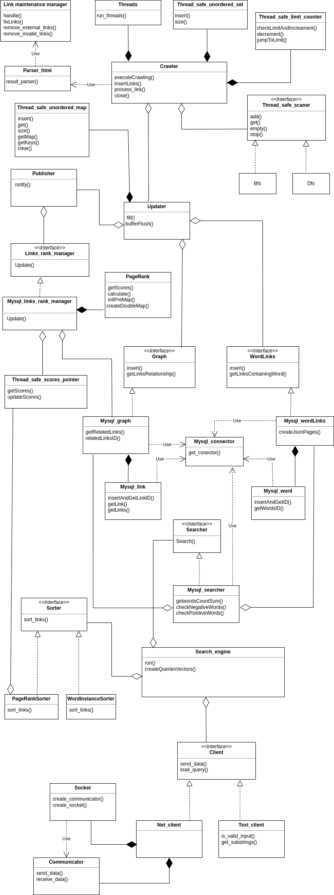

    [](https://www.gnu.org/software/make/manual/make.html)   

# Search Engine Project

The Search Engine Project is a web crawling application crafted in C++, intended to scan internet websites and archive the collected data into a MySQL database. It empowers users with the ability to input search queries, and the application provides search results consisting of links containing the specified keywords. The links are sorted using the [Pagerank](https://en.wikipedia.org/wiki/PageRank "Wiki") algorithm, which ranks internet pages to prioritize the most relevant search results. Additionally, the project supports receiving queries from remote users through the [TCP](https://en.wikipedia.org/wiki/Transmission_Control_Protocol "wiki") protocol. The project utilizes multithreading to enhance efficiency and enable concurrent searching and crawling, allowing users to search for information even while the crawling process is ongoing. It offers flexibility in its configuration options, allowing users to customize its behavior through a configuration file. Parameters such as scanning type ([BFS](https://en.wikipedia.org/wiki/Breadth-first_search "wiki") or [DFS](https://en.wikipedia.org/wiki/Depth-first_search "Wiki")), sorting method, and client interface (local or remote) can be defined to tailor the application to specific preferences and requirements.

## Main Objects

### Crawler

The `Crawler` class is responsible for traversing web pages by retrieving URLs and parsing HTML content. It utilizes the `Html_parser` object to extract links and text from the retrieved pages. The extracted data is then passed to the `Updater` class, which handles the insertion of data into the database. The `Updater` class holds instances of classes that implement the `Graph` interface, representing the relationship between links, and the `WordLinks` interface, representing links that contain words. The `Crawler` also interacts with instances of the `Scanner` interface, which can be configured for BFS or DFS strategies. `Thread_safe_set` are employed to ensure the uniqueness of URLs. Additionally, the crawling process is controlled by the `Limit_counter` object, which stops the crawler when a specified limit of links is reached. The `Limit_counter` object is thread-safe, allowing for concurrent access and increases.

### Search_engine

The `Search_engine` class is the application responsible for handling user queries, providing results, and sorting outcomes. The `Search_engine` class achieves its tasks by holding three objects:

- **Client Interface**: This object enables the `Search_engine` to receive queries from users. Whether the queries are entered locally via the console or remotely through sockets, the `Search_engine` efficiently manages user interactions.
- **Searcher Instance**: The `Search_engine` utilizes an instance of the `Searcher` interface to retrieve relevant search results from a specific database.
- **Sorter Instance**: Additionally, the `Search_engine` holds an instance of the `Sorter` interface to organize search results effectively. It can sort results either by word instances, the Pagerank algorithm, or any other custom sorting method specified.

## UML Class Diagram



## Design Patterns

### Singleton

The Singleton pattern is implemented for the `Configuration` class because many classes interact with it, and it holds important configuration settings such as the length of result links, number of threads, scanning type (BFS or DFS), sorting method, and whether the application is used locally or remotely. By making `Configuration` a Singleton, we ensure that there is only one instance of it throughout the application, and all classes can access its settings consistently.

### Observer

During the crawling process, whenever the `Updater` class finishes inserting a buffer of links into the database, it notifies the `Pagerank` class. The `Pagerank` class then calculates the Pagerank scores for the newly inserted links. This ensures that Pagerank scores are updated in real-time as new data is added to the database.

### Dependency Injection

 The `Crawler` and `Search_engine` classes interact with various components and rely heavily on different parameters, such as sorting method, scanning type, number of threads, and other important settings provided by the `Configuration` class. These dependencies are injected during object creation, allowing for easier testing and modification. This approach enables greater flexibility and maintainability by decoupling the classes from specific implementations and allowing them to be customized based on configuration settings.

## Dependencies

- **Gumbo Parser** : Used for parsing HTML content and extracting links from web pages.
  Install it using the command

```sh
sudo apt install -y libgumbo-dev
```

- **Curlpp**: Used for downloading pages from URLs.
  Install it using the command

```sh
sudo apt install -y libcurlpp-dev
```

- **MySQL Server***:Required for storge data

```sh
sudo apt install mysql-server
```

- **MySQL Connector/C++**: Required for database interaction.
  Install it using the command

```sh
sudo apt-get install libmysqlcppconn-dev
```

- **GCC Compiler**: Project requires `g++` compiler (version 7.3+) with C++17 support.

## Installing and running the program

- Clone the repository

```sh
git clone https://github.com/israelberger2/search_engine-.git
cd search_engine-
```

- Compile the files

```sh
make -j4
```

- Create MySql User and Schema
```sh
sudo mysql
```
for example: 
```sql
mysql>
mysql>
mysql>
```

- Update the file [configuration](includes/configuration.json) according to your settings

```sh
nano includes/configuration.json
```

```nano
{  
  "sql_password": "<password>",
  "sql_username": "<user name>",
  "sql_schema": "<schema name>",
  "sql_connectionString": "tcp://127.0.0.1:3306",
  "scans":500,
  "scanType": "bfs",
  "threads":1,
  "lengthResult":10,
  "linksMountForPagerank": 5,
  "ip": "127.0.0.1",
  "port": 8080,
  "clientType": "local",
  "sortType": "pageRank",
  "StartOfLink": "https://harrypotter.fandom.com",
  "addresses": ["https://harrypotter.fandom.com/wiki/Main_Page"]
}
```

- Run the program

```sh

```
